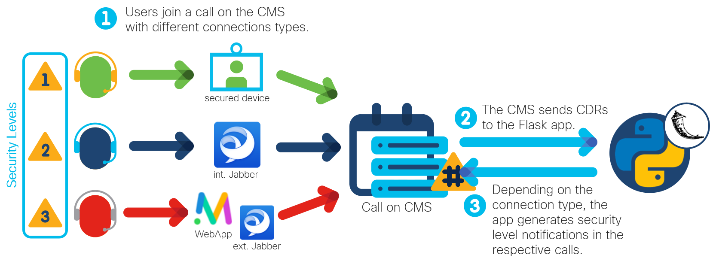

# Cisco Meeting Server Call Security Notifications

An application to notify participants in a CMS call if one or more external participant(s) are in the call or if the call is restricted (as indicated in the call's name) ([watch demo](https://youtu.be/6tUjXF3ALE0)).

## Overview
 

**Cisco Meeting Server**: The [CMS](https://developer.cisco.com/cisco-meeting-server/) brings premises-based video, audio, and web communication together to meet the collaboration needs of the modern workplace. Through the use of its APIs, calls and conferences can be flexibly managed and integrated into existing business workflows. This application focuses on notifying call participants if one or more external participant(s) who has/have joined using the CMS Web App is/are in the call and/or if the call's name indicates that it is a restricted call. The notification looks as follows: 

**Call Detail Records**: The CMS generates [Call Detail Records](https://www.cisco.com/c/dam/en/us/td/docs/conferencing/ciscoMeetingServer/Reference_Guides/Version-2-9/Cisco-Meeting-Server-CDR-Guide-2-9.pdf) (CDRs) internally for call-related events, such as a new call starting or a participant joining a call. These CDRs can be sent out by the CMS over HTTP or HTTPS as a series of XML documents to a receiving web server. In this prototype, the CDRs are sent to a Flask application that uses the incoming information to display real-time updated notifications in the respective calls. 

**Flask**: The application is written in Python using the micro web framework Flask. The web server that is part of Flask should not be used in production. 

## Contacts
* Jara Osterfeld (josterfe@cisco.com)

## Solution Components
* Cisco Meeting Server, incl. Call Details Records and its API
* Python
* Flask

## Prerequisites
- **CDR receiver URI**: In the CMS, the recipient device to which to send the CDR messages to needs to be configured. 
   - **Getting the URI**: In this prototype, the CDR receiver is the device on which the Flask app is running. The URI listening to the CDR messages sent from the CMS is therefore the public IP address of the device listening on port 5000 and taking the following format: `http://<public ip address>:5000/cdr`. The public IP address can for example be found with the `ipconfig` command on Windows. 
   - **Adding the URI as CDR receiver to the CMS**:
     1. Open the CMS web admin interface.
     2. Go to **Configure > CDR settings**.
     3. Add the CDR receiver URI as one of the four Receiver URIs.
     4. Repeat steps 1 to 3 for each CMS if clustered. 
     - Alternatively, this can be done using the CMS API. Instructions can be found in the [CDR Guide](https://www.cisco.com/c/dam/en/us/td/docs/conferencing/ciscoMeetingServer/Reference_Guides/Version-2-9/Cisco-Meeting-Server-CDR-Guide-2-9.pdf) under *Configuring the Recipient Devices*. 

## Installation

1. Clone this repository with `git clone <this repo>`.

2. Open the `credentials.yml` file, and fill in the following variables: 
        
        username: ''  # username to CMS
        password: ''# password to CMS
        cms_ips:
            - '' # list of IP addresses or DNS names of CMS(s)
        port: '' # https port on CMS

3. (Optional) Create a Python virtual environment and activate it (find instructions [here](https://docs.python.org/3/tutorial/venv.html)).

4. Navigate to the root directory of the repository in the terminal, and install the requirements with `pip install -r requirements.txt`.

5. Start the Flask app with `python main.py`.

## License
Provided under Cisco Sample Code License, for details see [LICENSE](./LICENSE).

## Code of Conduct
Our code of conduct is available [here](./CODE_OF_CONDUCT.md).

## Contributing
See our contributing guidelines [here](./CONTRIBUTING.md).